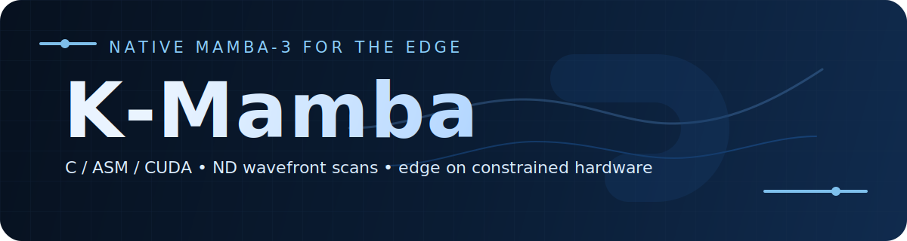

<p align="center">
  
</p>

# k-mamba

**Bibliothèque C pour Mamba-3 natif en dimensions N, pensée pour l'edge computing sur matériel contraint ou ancien.**

Architecture dualiste : **k-mamba** orchestre les Volontés (logique modèle), **optimatrix** fournit la Puissance (kernels ASM).

[](CMakeLists.txt)
[](LICENSE)

---

## Table des matières

- [Innovations](#innovations)
- [Structure](#structure)
- [Build](#build)
- [API](#api)
- [Architecture](#architecture)
- [Documentation](#documentation)
- [Citations](#citations)

---

## Innovations

### 1. Mamba-ND natif (N-dimensionnel)

Extension native de Mamba 1D vers N dimensions via **recurrence simultanée** :

```math
h(n) = Σ_{k=1}^{N} A_k · h(n − e_k) + B(n) · x(n)
```

```math
y(n) = C(n) · h(n)
```

- **Scan 1D** : séquentiel le long d'un axe
- **Scan 2D** : ordonnancement wavefront (diagonales anti), parallélisme intra-diagonale
- **Scan ND** : DAG N-dimensionnel complet

Différence avec l'état de l'art :

- **VMamba** (2024) : 4 scans 1D dans 4 directions (pas de vraie 2D)
- **Mamba-ND** (Li et al.) : scans 1D alternés par couche
- **k-mamba** : récurrence **native ND**, pas d'approximation séquentielle

### 2. Architecture Volontés/Puissance

```
k-mamba/              ← Volontés (intentions, orchestration)
├── Embedding lookup
├── Stack MambaBlocks
├── Checkpoint I/O
└── Training loop

optimatrix/           ← Puissance (calcul brut, kernels)
├── GEMM/GEMV AVX2
├── Scan 1D/2D ASM
├── ConvND separable
└── MUON + AdamW
```

Séparation philosophique : la logique modèle (triviale, 5-10 lignes) reste en C lisible ; le calcul lourd (millions d'itérations) est en assembleur AVX2 optimisé.

### 3. MUON natif CPU

Implémentation C/ASM de l'optimiseur MUON (arXiv:2502.16982, Moonshot AI) :

- Newton-Schulz orthogonalisation (5 itérations cubiques)
- Momentum Nesterov + gradient clipping global (L2)
- AdamW avec weight decay découplé pour embedding et LM head
- **Pas de dépendance PyTorch** — production pure C

### 4. Backend duel CPU/CUDA

- **CPU pur** : libc + libm, zéro dépendance — déployable sur CPU edge
- **Backend CUDA** (optionnel) : gradient_clip, AdamW, MUON sur GPU — testé sur MX450 (sm_75)
- **CUDA scan** (optionnel) : Blelloch parallel prefix scan pour les scans SSM sur GPU
- Pas de Python, pas de PyTorch

### 5. Théorie des Volontés

Cadre conceptuel original : les systèmes doivent opérer par **intentions** (Volontés) qui convergent vers un équilibre, pas par instructions séquentielles.

- Chaque MambaBlock = une Volonté qui transforme la séquence
- MUON = arbitre des tensions entre gradients
- Un bug = un **conflit de Volontés non résolu**

---

## Structure

```
k-mamba/                              ← Bibliothèque principale (modèle Mamba)
├── include/
│   ├── kmamba.h                   # API publique du modèle
│   └── scan.h                     # Types et API des scans sélectifs
├── src/
│   ├── kmamba.c                   # Orchestration : forward, backward, checkpoint
│   ├── mamba_block.c              # Bloc SSM complet (MUON + AdamW)
│   └── convnd.c                   # Convolution ND séparable (logique modèle)
├── cpu/                           # Kernels scan k-mamba (CPU)
│   ├── scan1d.asm                 # Scan sélectif 1D forward (AVX2)
│   ├── scan2d.asm                 # Scan sélectif 2D wavefront
│   ├── scan1d_backward.c          # Backward générique [L, D, M]
│   ├── scan1d_backward_m1_shared_bc.asm   # Backward M=1 optimisé ASM
│   └── mamba_scan.c               # Dispatch CPU scan
├── cuda/                          # Kernels scan k-mamba (CUDA)
│   ├── scan1d.cu                  # Blelloch scan 1D CUDA
│   ├── scan1d_backward.cu         # Backward scan 1D CUDA
│   └── mamba_scan.cu              # Dispatch CUDA scan
├── optimatrix/                    # Moteur de calcul matriciel
│   ├── include/optimatrix.h       # API (extern "C" compatible CUDA)
│   ├── cpu/
│   │   ├── gemm_avx2.asm          # GEMM AVX2 (C += A@B — accumule)
│   │   ├── gemv_avx2.asm          # GEMV AVX2
│   │   ├── activations.asm        # SiLU, Sigmoid, Softplus (AVX2)
│   │   ├── conv1d_avx2.asm        # Conv1D depthwise AVX2
│   │   ├── hadamard.asm           # Produit Hadamard AVX2
│   │   └── optimizer_utils.c      # gradient_clip, AdamW, MUON + Newton-Schulz (CPU)
│   └── cuda/
│       └── optimizer_utils.cu     # gradient_clip, AdamW, MUON (CUDA)
├── tests/
│   ├── test_optimizers.c          # 15 tests : clip L2, Newton-Schulz, MUON, AdamW
│   └── unit/
│       ├── test_optimatrix_kernels.c    # Kernels GEMM/conv/activation
│       ├── test_scan1d_backward_asm.c   # Backward ASM vs C de référence
│       └── test_conv1d_final.c          # Conv1D depthwise
├── bench/
│   └── bench_paper.c              # Benchmarks G1-G7
├── paper/
│   ├── kmamba.tex                 # Paper LaTeX
│   └── kmamba.bib                 # Bibliographie
├── CMakeLists.txt
├── THEORY.md                      # Fondement mathématique Mamba-ND
├── ESTIMATIONS.md                 # Complexité et benchmarks
└── ARCHITECTURE.md                # Philosophie Volontés/Puissance
```

---

## Build

### Prérequis

- `gcc >= 11`
- `nasm >= 2.15`
- `cmake >= 3.18`
- CPU avec AVX2 (Intel Haswell+ / AMD Ryzen+)
- CUDA Toolkit >= 11.0 + GPU sm_75+ (optionnel)

### Compilation

```bash
git clone --recursive https://github.com/goldensam777/k-mamba
cd k-mamba

# CPU seul
cmake -B build -DKMAMBA_BUILD_TESTS=ON
cmake --build build -j

# CPU + CUDA (sm_75, MX450)
cmake -B build-cuda -DKMAMBA_BUILD_CUDA=ON -DKMAMBA_BUILD_TESTS=OFF \
      -DCMAKE_CUDA_ARCHITECTURES=75
cmake --build build-cuda -j
```

### Tests

```bash
# CPU : optimatrix kernels + 15 tests optimiseurs + backward ASM
ctest --test-dir build

# Résultats attendus : 15/15 PASS
./build/tests/test_optimizers
```

Résultats validés (18 mars 2026, x86-64 AVX2) : voir **[TEST_RESULTS.md](TEST_RESULTS.md)**.

### Usage dans un projet CMake

```cmake
find_package(k-mamba REQUIRED)
target_link_libraries(mon_app PRIVATE k-mamba::k-mamba)
```

---

## API

### Création

```c
#include <kmamba.h>

KMambaConfig cfg = {
    .vocab_size = 256,      // byte-level
    .dim        = 384,
    .state_size = 1024,
    .seq_len    = 128,
    .n_layers   = 1,
    .dt_scale   = 1.0f,
    .dt_min     = 0.001f,
    .dt_max     = 0.1f
};

KMamba *m = kmamba_create(&cfg);
kmamba_init(m, 1234);       // Xavier init
```

### Entraînement

```c
MBOptimConfig opt = {
    .lr = 1e-3f, .mu = 0.9f, .beta2 = 0.999f,
    .eps = 1e-8f, .clip_norm = 1.0f, .weight_decay = 1e-5f
};
kmamba_enable_training(m, &opt, 1e-3f, 1e-5f);

// Une séquence (seq_len+1 bytes)
float loss = kmamba_train_step(m, tokens_plus1);

// Batch
float loss = kmamba_train_batch(m, batch_tokens, batch_size);
```

### Inférence

```c
uint8_t tokens[seq_len];
float logits[seq_len * vocab_size];
kmamba_forward(m, tokens, logits);
```

### Checkpoint

```c
kmamba_save(m, "checkpoint.bin");
KMamba *m = kmamba_load("checkpoint.bin", 1, &opt, lr, wd);
kmamba_free(m);
```

---

## Architecture

### Séparation des responsabilités

| k-mamba (Volontés — logique modèle) | optimatrix (Puissance — calcul générique) |
|-----------------------------------|----------------------------------------|
| **Responsabilité** : implémentation du modèle Mamba (SSM, orchestration) | **Responsabilité** : primitives de calcul haute performance |
| **Dépendance** : utilise optimatrix pour les kernels | **Dépendance** : aucune (pur ASM/C) |
| **Fichiers** : | **Fichiers** : |
| └─ `kmamba.c` — orchestration du modèle (forward/backward, checkpoint) | └─ `activations.asm` — SiLU, Sigmoid, Softplus (AVX2) |
| └─ `mamba_block.c` — bloc SSM complet (avec Muon) | └─ `conv1d_avx2.asm` — noyau Conv1D depthwise |
| └─ `convnd.c` — convolution ND (appelle le noyau 1D) | └─ `gemm.asm`, `gemv.asm` — multiplication matricielle |
| | └─ `scan1d.asm`, `scan2d.asm` — scans sélectifs |
| | └─ `scan1d_backward*.c/.asm` — rétropropagation des scans |
| **Opérations** : | **Opérations** : |
| └─ Embedding lookup (`memcpy`) | └─ GEMM/GEMV (AVX2) |
| └─ Softmax, cross-entropy | └─ Scan sélectif 1D/2D (ASM) |
| └─ Training loop (boucles sur batch) | └─ ConvND séparable (C) |
| └─ Checkpoint I/O (format binaire) | └─ MUONCLIP optimizer (C) |
| └─ LM head projection | └─ Activations vectorisées (AVX2) |

### Pipeline MambaBlock

```plain
input [seq_len × dim]
    │
    ▼
W_in : dim → state_size (GEMV)
    │
    ▼
SiLU (gate)
    │
    ▼
delta_proj + softplus + clamp → dt_t
    │
    ▼
Selective Scan (1D ou 2D wavefront)
    h_t = exp(dt · A) · h_{t−1} + dt · B · u_t
    y_t = C · h_t
    │
    ▼
W_out : state_size → dim (GEMV)
    │
    ▼
output [seq_len × dim]
```

---

## Documentation

- **[THEORY.md](THEORY.md)** — Fondement mathématique du scan Mamba-ND
- **[ESTIMATIONS.md](ESTIMATIONS.md)** — Complexité théorique et benchmarks mesurés
- **[ARCHITECTURE.md](ARCHITECTURE.md)** — Philosophie Volontés/Puissance
- **[TEST_RESULTS.md](TEST_RESULTS.md)** — Résultats de tests CPU + CUDA (17/03/2026)
- **[SOURCES.md](SOURCES.md)** — Bibliographie complète avec tags de citation
- **[paper/kmamba.tex](paper/kmamba.tex)** — Paper arXiv en LaTeX

---

## Citations

```bibtex
@software{k-mamba,
  author = {YEVI, Mawuli Peniel Samuel},
  title = {k-mamba: Native N-dimensional Mamba State Space Models in C/ASM},
  url = {https://github.com/user/k-mamba},
  year = {2025}
}

@software{optimatrix,
  author = {YEVI, Mawuli Peniel Samuel},
  title = {optimatrix: High-performance compute kernels for Mamba-ND},
  url = {https://github.com/user/optimatrix},
  year = {2025}
}
```

---

## Auteur

**YEVI Mawuli Peniel Samuel** — IFRI-UAC, Bénin

**Devise**: *Ego Sum Optimus Optimus*  
**Conviction**: *On est assez grand pour voir des unités, il faut voir des structures.*

---

## License

MIT
